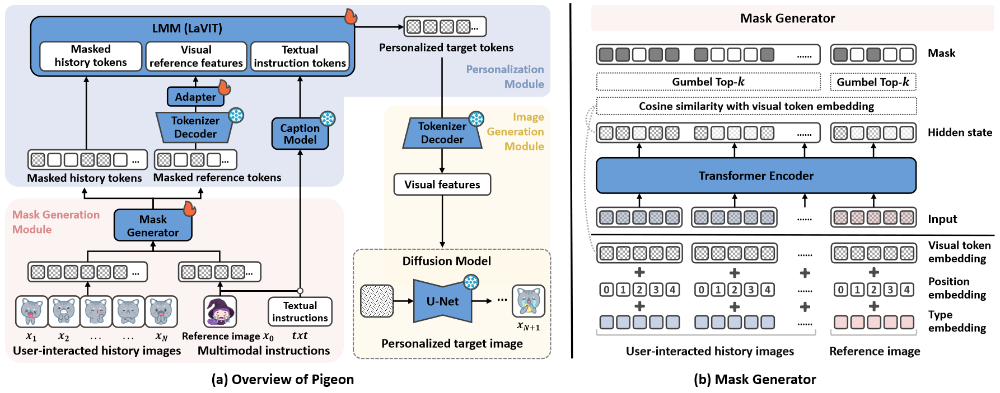

# Personalized Image Generation with Large Multimodal Models

This is the pytorch implementation of our paper at WWW 2025:
> [Personalized Image Generation with Large Multimodal Models](https://arxiv.org/abs/2410.14170)
> 
> Yiyan Xu, Wenjie Wang, Yang Zhang, Biao Tang, Yan Peng, Fuli Feng, Xiangnan He

## Pigeon Overview
Pigeon consists of three key modules: 1) mask generation module creates token-level masks for history and reference images, 2) personalized module encodes multimodal instructions and integrates them with masked history to generate personalized tokens, and 3) image generation module utilizes these tokens to produce personalized images.


## Environment
- Anaconda 3
- python 3.8.13
- cuda 12.2
- peft 0.7.1
- torch 2.3.0
- torchvision 0.18.0
- Pillow 10.2.0
- numpy 1.24.4
- transformers 4.33.2
- open-clip-torch 2.24.0
- accelerate 0.28.0
- diffusers 0.27.2
- xformers 0.0.27.dev792
- pytorch-fid 0.3.0
- lpips 0.1.4

## Usage
### Dataset
Download the datasets into the "./dataset" folder from [here](https://drive.google.com/drive/folders/1MpvkQ_DCimfcXBZJpPmliNf8s4reUA9B?usp=drive_link), including SER-30K and MovieLens-Latest-small for sticker and movie poster scenarios, respectively.

#### Sticker
* **data_path:** `./dataset/SER-30K/processed_seq`

* **`mapped_anno_dict.npy`:** dict of sticker info.
    ```python
    {
        
        iid1: {  # image id
            'emo': 'Neutral',  # sticker emotion, like sadness
            'text': ''  # sticker text, most are empty
        },
        iid2: ...,
        ...
    }
    ```

* **`mapped_user_dict.npy`:** dict of user-interacted seqs, where each user interacts with a single theme.
    ```python
    {
        uid1: {  # user id
            gid1: [iid1, iid2, ...], # user historically interacted iids
        },
        uid2: {
            gid2: ...,
        },
        ...
    }
    ```

* **`train.npy`, `valid.npy` & `test.npy`:** We apply a sliding window of six interactions, moving one step at a time to create data samples for each user in both scenarios. Each sample treats the first five interactions as the user history images and the last as the target image. We split the samples into training, validation, and testing sets with a ratio of 8:1:1.
    ```python
    {
        uid1: {  # user id
            gid1: [  # genre id
                [iid1, iid2, iid3, iid4, iid5, iid6],  # interaction sequence, where the last one serves as the target image and the preceding ones are history images
                [...],
                ...
            ],
        },
        uid2: {...},
        ...
    }
    ```

* **`all_image_paths.npy`:** list of image paths arranged according to iids.
    * **image_folder_path:** `./dataset/SER30K/Images`
    ```python
    import numpy as np
    from PIL import Image
    import os

    img_folder_path = "./dataset/SER-30K/Images"
    all_image_paths = np.load("./dataset/SER30K/processed_seq/all_image_paths.npy", allow_pickle=True)

    iid = 100
    img_path = os.path.join(img_folder_path, all_image_paths[iid])
    im = Image.open(img_path)
    display(im)
    ```

* **`sticker_semantics.npy`:** list of textual descriptions of each image with the same format as `all_image_paths.npy`.

* **`all_clip_feats.npy` & `all_dino_feats.npy`:** list of extracted CLIP and DINO features for evaluation with the same format as `all_image_paths.npy`.

* **`/map`:** maps of image id and user id saved during data preprocessing.

* **`/data_ready`:** data processed for Pigeon training and evaluation.
    * **`train_ready.npy`, `valid_ready.npy` & `test_ready.npy`** 
        ```python
        {   
            'uids': [uid1, uid2, ...],
            'genres': [gid1, gid2, ...],
            'image': [
                [iid1, iid2, iid3, iid4, iid5, iid6],  # the interaction seq of uid1
                ...
            ]
            'text_input_ids': [...],
            'text_attn_mask': [...],
        }
        ```

    * **`train_hist_embeds.npy`，`valid_hist_embeds.npy` & `test_hist_embeds.npy`:** for evaluation.
        ```python
        {
            uid1: {
                target_iid1: {
                    gid1: ..., # clip features of the target_iid image
                },
                target_iid2: {...},
                ...
            },
            uid2: ...,
            ...
        }
        ```

* **`/dpo`:** preference dataset for the second-stage preference alignment.
    * **`train_preference_data.npy` & `valid_preference_data.npy`**
        ```python
        {
            uid1: {
                target_iid1: {
                    gid1: {
                        'chosen': ...,  # chosen token sequence for <uid, target_iid1>
                        'rejected': ...  # rejected token sequence for <uid, target_iid1>
                    }
                },
                target_iid2: {...},
                ...
            },
            uid2: ...,
            ...
        }
        ```

    * **`train.npy` & `valid.npy`**: randomly sampled subset of the above `train.npy` & `valid.npy` for the second-stage training.

* **`/data_ready_dpo`:** data processed for the second-stage DPO.
    * **`train_ready.npy` & `valid_ready.npy`**
        ```python
        {   
            'uids': [uid1, uid2, ...],
            'genres': [gid1, gid2, ...],
            'image': [
                [iid1, iid2, iid3, iid4, iid5, iid6],  # the interaction seq of uid1
                ...
            ]
            'text_input_ids': [...],
            'text_attn_mask': [...],
            'chosen_tokens': [...],
            'rejected_tokens': [...]
        }
        ```

#### Movie Poster
* **data_path**: `./dataset/ml-latest-small/processed_seq`

* **image_folder_path:** `./dataset/ml-latest-small/poster`

* **`mapped_movies.npy`:** dict of movie info.
    ```python
    {
        iid1: {  # image id / movie id
            'title': 'Star Wars: Episode VI - Return of the Jedi (1983)',  # movie title
            'genres': 'Action|Adventure|Fantasy',  # movie genres
            'intro': ...  # movie introduction
        },
        iid2: ...,
        ...
    }
    ```

* **`user_seq_dict.npy`:** dict of user interaction history with the same format as `mapped_user_dict.npy` in the sticker dataset.

* **Other data are the same as the sticker dataset.**

### Pre-trained Models
Please download the following pre-trained models for fine-tuning and evaluation.
- [LaVIT](https://huggingface.co/rain1011/LaVIT-7B-v2)
- [SDXL](https://huggingface.co/stabilityai/stable-diffusion-xl-base-1.0)
- [DINO-v2](https://huggingface.co/facebook/dinov2-large) (for evaluation)

### Training
#### Stage-1: Masked Preference Reconstruction
Please configure the correct paths of all data in `finetune_sft.py` and `run_sft.sh`.
```
cd ./Pigeon
sh run_sft.sh
```

#### Stage-2: Pairwise Preference Optimization
Please configure the correct paths of all data in `finetune_dpo.py` and `run_dpo.sh`. And set the appropriate ckpt after the first-stage alignment for the second-stage fine-tuning.
```
cd ./Pigeon
sh run_dpo.sh
```

### Inference
1. Download the checkpoint released by us from [here](https://drive.google.com/drive/folders/1Hax0ZubvHqaGvUROVzD32_iKPpi8mYh1?usp=drive_link).
2. Put the checkpoint into the appropriate folder.
3. Configure correct paths of all data in `inference.py`.
4. Run inference.py
```
cd ./Pigeon
sh run_inf.sh
```
5. Calculate the history CIS and reference CS for each generated target image.
```
cd ./Evaluation
sh run_cal_scores.sh
```
6. Run the `./Evaluation/select_scores.ipynb` file to select the optimal reference mask ratio $\alpha_r$ (generated target image).

### Evaluation
Run the evaluation code through the `.sh` files.
```
cd ./Evaluation
sh run_eval_pigeon.sh
```

### Preference Dataset Construction
After completing the first stage of fine-tuning, you can follow these steps to construct your own preference dataset for DPO:
1. Using the first-stage checkpoint, run `./Pigeon/run_inf.sh` to generate multiple personalized target images for both the training and validation sets:
- For the training set: --mode train --eval_num 1000
- For the validation set: --mode valid --eval_num 200
3. Calculate the history CIS and reference CS for each generated target image by executing `./Evaluation/run_cal_scores.sh`.
4. Run the `./Evaluation/select_scores_dpo.ipynb` file to construct the preference pairs for DPO training.

### Acknowledgments
Our work heavily relies on the excellent contributions of [LaVIT](https://github.com/jy0205/LaVIT). We sincerely thank the team for their efforts.
