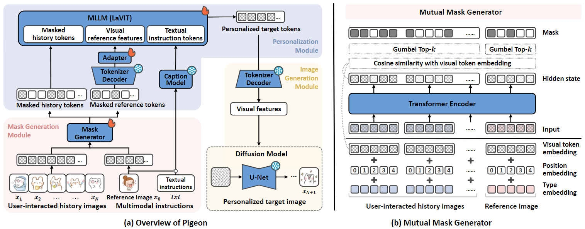

# Personalized Image Generation with Large Multimodal Models

This is the pytorch implementation of our paper:
> Personalized Image Generation with Large Multimodal Models

## Pigeon Overview
Pigeon consists of three key modules: 1) mask generation module creates token-level masks for history and reference images, 2) personalized module encodes multimodal instructions and integrates them with masked history to generate personalized tokens, and 3) image generation module utilizes these tokens to produce personalized images.


## Environment
- Anaconda 3
- python 3.8.13
- peft 0.7.1
- torch 2.3.0
- torchvision 0.18.0
- Pillow 10.2.0
- numpy 1.24.4
- transformers 4.33.2
- open-clip-torch 2.24.0
- accelerate 0.28.0
- diffusers 0.27.2
- xformers 0.0.27.dev792
- pytorch-fid 0.3.0
- lpips 0.1.4

## Usage
### Dataset
Download the datasets into the "./dataset" folder from [here](https://drive.google.com/drive/folders/1MpvkQ_DCimfcXBZJpPmliNf8s4reUA9B?usp=drive_link), including SER-30K and MovieLens-Latest-small for sticker and movie poster scenarios, respectively.

### Training
#### Stage-1: Masked Preference Reconstruction
Please configure the correct paths of all data in `finetune_sft.py` and `run_sft.sh`.
```
cd ./Pigeon
sh run_sft.sh
```

#### Stage-2: Pairwise Preference Optimization
Please configure the correct paths of all data in `finetune_dpo.py` and `run_dpo.sh`. And set the appropriate ckpt after the first-stage alignment for the second-stage fine-tuning.
```
cd ./Pigeon
sh run_dpo.sh
```

### Inference
1. Download the checkpoint released by us from [here](https://drive.google.com/drive/folders/1Hax0ZubvHqaGvUROVzD32_iKPpi8mYh1?usp=drive_link).
2. Put the checkpoint into the appropriate folder.
3. Configure correct paths of all data in `inference.py`.
4. Run inference.py
```
cd ./Pigeon
sh run_inf.sh
```

### Evaluation
Run the evaluation code through the `.sh` files.
```
cd ./Evaluation
sh run_eval_pigeon.sh
```
